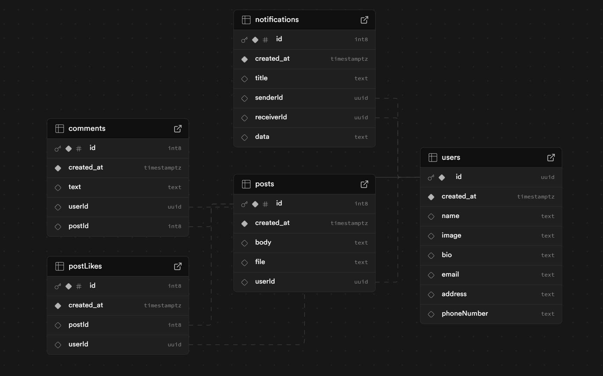

# Social Media App

This is a social media app project created as part of the subject **DES427: Mobile Application Programming**. It demonstrates mobile app development skills and integrates **Supabase** for backend services.

## Project Overview

This social media app provides the following core functionalities:
- User signup and login.
- Photo uploads and personalized feed generation.
- User interactions including follow and unfollow actions.
- Notifications for user activity.
- Integration with **Supabase** for data storage and real-time updates.

The backend development, including database design, user authentication, API creation, and notification handling, was handled by **Pavinee Pattanapornchai**.

## Features

- **User Authentication**: Secure signup and login functionality using Supabase.
- **Photo Uploads**: Users can upload and share photos on their profile.
- **Personalized Feeds**: Display customized content based on user activity and connections.
- **Follow/Unfollow System**: Users can follow and unfollow other profiles.
- **Real-time Updates**: Changes are reflected immediately using Supabase's real-time capabilities.
- **Notification System**: Users receive notifications about interactions like follows and comments.

## Contributors

This project was developed by:
- **Jarawee Saengkaewsuk**
- **Pavinee Pattanapornchai**
- **Aranrak Petchsakul**

## Database Visual Representation

Below is the visual representation of the database structure used in this project:



Make sure to refer to this image for understanding how data is organized and managed within the app.

## Getting Started

Follow these steps to set up and run the application locally:

### Prerequisites

Make sure you have the following installed on your system:
- **Node.js** (https://nodejs.org/)
- **npm** (comes with Node.js)
- **Supabase account** and project set up (https://supabase.com/)

### Installation

#### Clone the repository
```bash
git clone <repository-url>
cd <repository-directory>
```

#### Install dependencies
```bash
npm install
```

#### Set up environment variables
Replace the following variables in `index.js` in the `constants` folder:
```javascript
SUPABASE_URL = '<your-supabase-url>';
SUPABASE_KEY = '<your-supabase-key>';
```
Replace `<your-supabase-url>` and `<your-supabase-key>` with your Supabase project credentials.

### Running the Application

Start the development server:
```bash
npm start
```

Access the app at `http://localhost:3000` in your browser.

## Deployment

For deployment, use any platform that supports Node.js applications, such as:
- **Vercel** (https://vercel.com/)
- **Netlify** (https://www.netlify.com/)

Make sure to set the same environment variables in the deployment platform.

## Technology Stack

- **Frontend**: React Native
- **Backend**: Supabase (Database, Authentication, Real-time updates)
- **Other Tools**: npm, Expo
